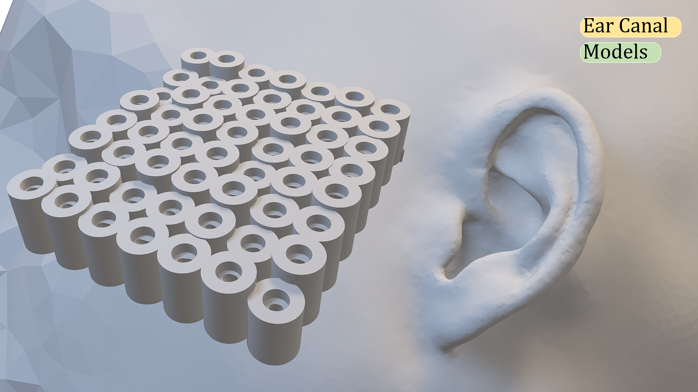

# 3D-Printed Left Ear-Canal Models

> #### ⚠️ REPOSITORY UNDER PREPARATION
> **THE STL FILES ARE NOT YET AVAILABLE.**
>
> The associated manuscript is currently being prepared for submission. The STL files used in the study will be uploaded here after the paper has been accepted for publication.




This repository will contain modified **left-ear canal STL models** that may be useful for hearing and acoustic research. In our study, the models are used to investigate IMD cancellation for single-transducer DPOAE measurements.

The models were derived from the **IHA database of human geometries, Version 2**:

R. Roden and M. Blau, *The IHA database of human geometries including torso, head and complete outer ears for acoustic research. V2*, Zenodo, 2025.  
https://doi.org/10.5281/zenodo.16949997

## Planned files

```text
individual_left_ear_canals/
    ear_canal_01.stl
    ...
    ear_canal_58.stl
    # excluding 22 and 35

complete_grid/
    56_ear_canal_8x7_grid.stl
```

Only the **left ear canal** from each source geometry was used. Models **#22 and #35** were excluded because the extracted meshes contained openings that prevented reliable generation of closed printable models.

## Model design

Each anatomical ear canal was incorporated into a cylindrical test model while preserving its individual internal ear-canal geometry. During preliminary measurements, the rigid PLA models showed pronounced antiresonant notches in the probe-microphone frequency response. To reduce these notches, a soft silicone plug was added at the medial end as a **more compliant silicone termination**. This modification was useful for reducing the antiresonant behavior, but the silicone termination was not designed as a quantitative model of the human tympanic membrane.

For convenient printing and measurement, the 56 models were combined into a single **8 × 7 array**.

## Printing used in our study

- Printer: **Bambu Lab P1S**
- Material: **PLA**
- Nozzle: **0.4 mm**
- Wall loops: **7**

## Citation

Please cite the original IHA database when using these derived models:

> Roden, R., & Blau, M. (2025). *The IHA database of human geometries including torso, head and complete outer ears for acoustic research. V2*. Zenodo. https://doi.org/10.5281/zenodo.16949997

## License

These derived files will be distributed under **CC BY-NC-SA 4.0**, consistent with the license information supplied with the source IHA database.

See [`LICENSE`](LICENSE) for details.
